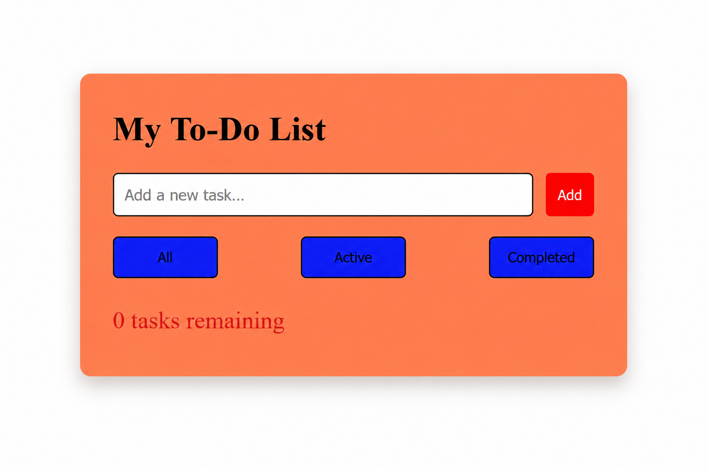

# To-do-List-app
A responsive To-Do List web app built with HTML, CSS, and JavaScript featuring task filtering, completion tracking, and a clean user interface.

# 📝 To-Do List App

A clean and responsive To-Do List web application built with **HTML, CSS, and JavaScript**. This project allows users to organize daily tasks by adding, completing, and filtering tasks through a simple and user-friendly interface.

---

## 🚀 Live Demo

https://to-do-list-sainath.netlify.app/

---

## 📸 Preview



---

## ✨ Features

- ➕ Add new tasks
- ✅ Mark tasks as completed
- 📋 View all tasks
- 🔵 View active tasks only
- ✔️ View completed tasks only
- 📊 Remaining task counter
- 📱 Responsive design
- ⚡ Fast and lightweight interface

---

## 🛠️ Technologies Used

- HTML5
- CSS3
- JavaScript (ES6)

---

## 📂 Project Structure

```
todo-list/
│
├── index.html
├── style.css
├── app.js
├── screenshot.png
└── README.md
```

---

## 💡 Concepts Practiced

- DOM Manipulation
- Event Handling
- Dynamic Element Creation
- Array Operations
- Conditional Rendering
- JavaScript Functions
- CSS Flexbox
- Responsive Design

---

## ▶️ Getting Started

1. Clone the repository

```bash
git clone https://github.com/yourusername/todo-list.git
```

2. Open the project folder.

3. Open `index.html` in your browser.

---

## 📈 Future Improvements

- ✏️ Edit tasks
- 🗑️ Delete tasks
- 💾 Local Storage support
- 🌙 Dark Mode
- 🔍 Search tasks
- 📅 Due dates
- 🏷️ Categories
- ⭐ Task priorities

---

## 👨‍💻 Author

**Sainath**

If you found this project helpful, consider giving it a ⭐ on GitHub!
